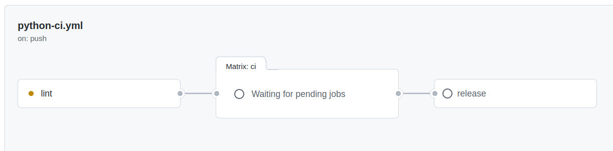
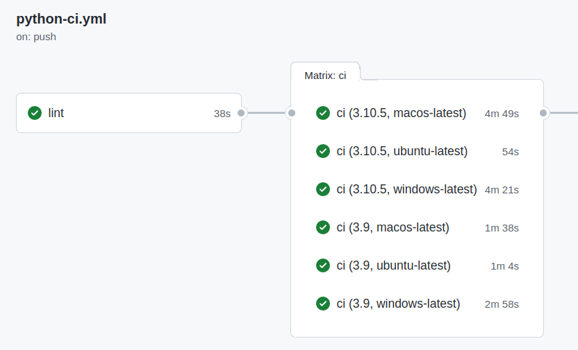

# automatic-eureka

Before starting to develop CICD pipelines it is worth understanding how code and applications are Built, Configured, 
Tested, Released, Packaged and Stored (B.C.T.R.P.S). Examples of which are covered in this project with the following 
use cases in mind: 

#### Continuous Integration (CI)
We use continuous integration (CI) to fetch source code from a git repository and then execute **B.C.T.R.P.S** where the 
release version is normally generated.

#### Continuous Delivery (CD)
If we have released an application that runs as a services, has an endpoint on the network that we can use, then we will 
probably want to use continuous delivery (CD) to run that application in some environment.

#### Continuous Integration (CI) for Utilities
We might want to use software packages for our pipelines as utilities, why? If we can develop and follow **B.C.T.R.P.S**
with pipeline code utilities also it allows us to control the use of these utilities via the version. Also we can simplify 
and make our pipeline code more readable, for example `agileup` might be a useful python package that we have written.

```shell
tasks:
- plugin:
    configuration:
      id: script-executor
      version: 1.0.1
    options:
      script: |-
        agileup -E DEV --list 
      shtype: bash
    run_if: passed
```    

## Source To Binary To Image Method

The **B.C.T.R.P.S** steps here might be considered to be the more traditional way of providing applications to users that
with the correct automation can be used for DevOps.

### Build

The build process for any project very much depends on the langauge used and the decisions made by development teams. From
and DevOps point of view though all we need to understand are the steps needed to build the software into some chosen package.

### Configure

The [12 Factor](https://12factor.net/) approach to configuration should always be followed. 

### Test/QA

**Testing** is used to verify the correct operation of software before it is released, testing can also be applied 
to a number of different operating systems, for example using GitHub actions we can define the following CI pipeline.





Here the "lint" step is used for code QA and the "Matrix: ci" step performs build and test once this is successful on the
target OS images then the release step is ran and the package is published.

**For Quality Assurance (QA)** you might consider adding https://codeql.github.com/ or https://www.sonarqube.org/features/quality-gate/ 
quality gates to your pipelines.  ###

### Release

Most release processes only run and create a package when Test/QA has ran to success and often follow these steps:

1. Update source code to next version often a good choice is to use [semver](https://semver.org/).
2. Commit and tag the changes.
3. Push changes and tags to git.

### Package

Some examples of the relationships between packages, repositories and application entry points:

| Language | Package Type                            | Repository Type | Entry Point                               |
|----------|-----------------------------------------|-----------------|-------------------------------------------|
| Python   | [Poetry](https://python-poetry.org/)    | PyPi            | [tool.poetry.scripts]                     |
| Java     | [Maven/Jar](https://maven.apache.org/)  | Maven           | public static void main(String args[])    |
| C#       | [NuGet](https://www.nuget.org/)         | NuGet           | static void Main(string[] args)           |
| ANY      | [OCI](https://opencontainers.org/)      | Docker          | ENTRYPOINT ["SOME_COMMAND","ARG1","ARG2"] |

Meta-data used within a package specification normally also refers to dependencies that must be included for the 
application to work. For poetry python packages this is defined in the **pyproject.toml** file for example:

```ini
[tool.poetry.dependencies]
python = "^3.9"
click = "^8.1"
PyYAML = "^5.4.1"
pytest = "^7.1.3"
prettytable = "^3.3.0"
Fabric3 = "^1.14.post1"
```

### Store

From a software package point of view, the objective of continuous integration to build, test/QA and release a software 
project with a unique version number and save that package in a repository.

**A Repository** can be public, an example of a public repository containing a released package might 
be https://pypi.org/project/agileetc/ for python and https://hub.docker.com/repository/docker/agileturret/gocd-agent-ubuntu-20.04 for docker.

**A Repository** can be private an example of a private repository containing a released package might be:
1. https://jfrog.com/artifactory/
2. https://www.sonatype.com/products/nexus-repository
3. And solutions from your cloud vendor

## Source To Image Method

The **B.C.T.R.P.S** steps here might allows you to move from source code to image and running application in very few steps.

This is more developer than operations focused as developers are not really interested in learning operations. The examples
here are also very similar to current `serverless technologies` offered in the cloud.

All we need for this is to install [pack](https://buildpacks.io/docs/tools/pack/) which is part of the 
[buildpacks](https://buildpacks.io/) initiative supported by Heroku & CloudFoundry.

> Cloud Native Buildpacks transform your application source code into images that can run on any cloud.

> Pack runs against a docker host.

### CICD Source to Image

| Language | Instructions                                                  |
|----------|---------------------------------------------------------------|
| Python   |                                                               |
| Python   |                                                               |
| Java     | [sample-application-1](java/sample-application-1/README.md)   |

### GoCD Server Example Docker Image

As an example we can use a simple [Docker In Docker](https://devopscube.com/run-docker-in-docker/) approach 
to run our pack commands against a docker host and build our application images. 

```shell
FROM gocd/gocd-agent-docker-dind:v22.2.0
LABEL maintainer="Paul.Gilligan@agilesolutions.co.uk"

ENV TZ=Etc/UTC
ENV DEBIAN_FRONTEND=noninteractive
ENV GOCD_USER go

USER root

RUN (curl -sSL "https://github.com/buildpacks/pack/releases/download/v0.27.0/pack-v0.27.0-linux.tgz" | sudo tar -C /usr/local/bin/ --no-same-owner -xzv pack)

USER ${GOCD_USER}
```
