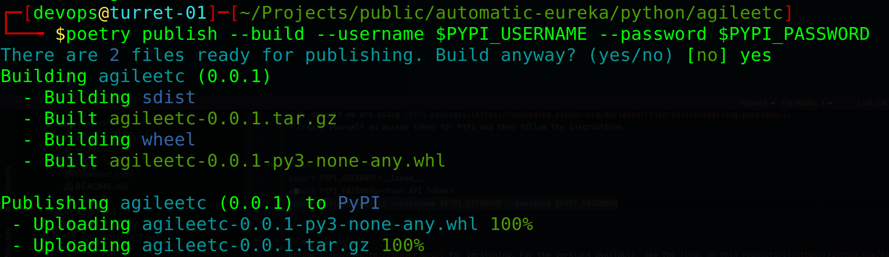

# agileetc

Example python 3.9+ project where we can develop best practices and provide teams with a useful template.

## Prerequisites

This project uses poetry is a tool for dependency management and packaging in Python. It allows you to declare the 
libraries your project depends on, it will manage (install/update) them for you. Use the installer rather than pip:

[installing-with-the-official-installer](https://python-poetry.org/docs/master/#installing-with-the-official-installer).

```sh
poetry self add poetry-bumpversion
```

```sh
poetry -V
Poetry (version 1.2.0)
```

## Features

1. Poetry packaged python project with example CLI entry point.
2. Linux and Windows compatible project.
3. Example read/write YML files.
4. Example Unit Tests.
5. Example flake8 linter configuration.
6. Example line operation via click API allowing project to be ran from command line of from CICD pipelines.
7. Example use of Fabric API to execute external commands.
8. Example use of Texttable for pretty table output.
9. Example Jenkins pipeline.
10. Example GitHub actions. 
11. 11Python package publishing to PiPy. 
12. Docker image publishing to docker hub. 
13. Example usage of python package. 
14. Example usage of docker image.

## Getting Started

```sh
poetry update
```

```sh
poetry install
```

## Run
```sh
poetry run agileetc
```

## Lint
```sh
poetry run flake8
```

## Test
```sh
poetry run pytest
```

## Publish

* By default we are using [PYPI packages](https://packaging.python.org/en/latest/tutorials/installing-packages/). 
* Create yourself an access token for PYPI and then follow the instructions.

```sh
export PYPI_USERNAME=__token__ 
export PYPI_PASSWORD=<Your API Token>
poetry publish --build --username $PYPI_USERNAME --password $PYPI_PASSWORD
```



## Versioning
We use [SemVer](http://semver.org/) for versioning. For the versions available, see the [tags on this repository](https://github.com/Agile-Solutions-GB-Ltd/agileup/tags). 

## Releasing

We are using [poetry-bumpversion](https://github.com/monim67/poetry-bumpversion) to manage release versions.

```sh
poetry version patch
```

## Contributing

Please read [CONTRIBUTING.md](CONTRIBUTING.md) for details on our code of conduct, and the process for submitting pull requests to us.

## License

This project is licensed under the Apache License, Version 2.0 - see the [LICENSE](LICENSE) file for details


